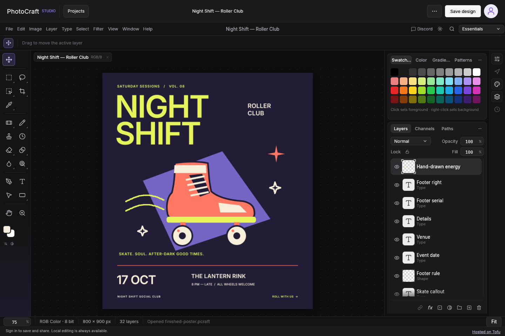
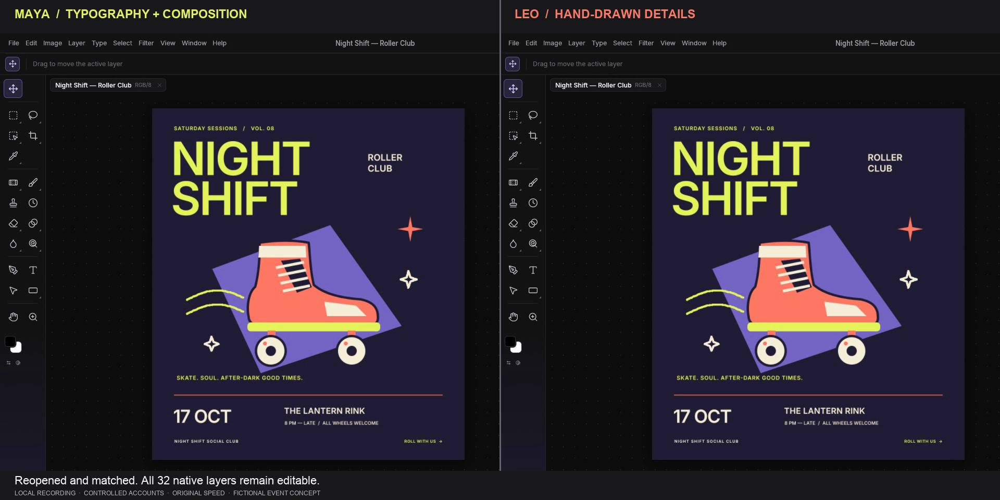

# PhotoCraft Studio

PhotoCraft Studio is a browser-based image editor with cloud projects, sharing, and collaboration.

It is an independent fork of [PhotoCraft](https://github.com/storytold/photocraft), created by the ArtCraft team and PhotoCraft contributors. Their Rust editor, painting tools, document model, file formats, and GPU renderer remain its foundation. We thank the upstream contributors. This fork is maintained separately and is not affiliated with, sponsored by, or endorsed by the original project or the ArtCraft team.

PhotoCraft Studio is deployed on [Tofu](https://trytofu.ai/), which helps your coding agent take an existing app online with hosting, a managed database, Google sign-in, and transactional email in one place. To take your own app from local development to the web, [try Tofu](https://trytofu.ai/) or explore its [documentation](https://trytofu.ai/docs).

[](https://trytofu.ai/)

[Open the editor](https://photocraft-studio-d42c446ec275.trytofu.app/) · [Explore PhotoCraft Studio](https://photocraft-studio-d42c446ec275.trytofu.app/about.html) · [How we deployed with Tofu](docs/tofu-deployment.md)



[Watch the editing walkthrough](https://photocraft-studio-d42c446ec275.trytofu.app/media/editing-walkthrough.mp4) · [Watch two editors collaborate](https://photocraft-studio-d42c446ec275.trytofu.app/media/collaboration-demo.mp4)

The editing video finishes an original roller-night poster with Type, Move and Pencil, then shows Undo/Redo and a layered file save/reopen. In the collaboration video, Maya develops the headline and composition while Leo draws the finishing details. Real collaborator cursors, Pencil/Move previews and matching saved results are visible. Both films run at original speed in this browser editor, recorded locally with a fictional event and controlled accounts. The public editor is deployed on Tofu; these recordings do not measure internet latency.

[](https://photocraft-studio-d42c446ec275.trytofu.app/about.html#collaboration-demo)


[Watch the editing walkthrough](https://photocraft-studio-d42c446ec275.trytofu.app/media/editing-walkthrough.mp4) · [Watch two editors collaborate](https://photocraft-studio-d42c446ec275.trytofu.app/media/collaboration-demo.mp4)

The editing video follows a real template through text changes, artwork movement, Undo/Redo and a layered file download/reopen. The collaboration video shows two independent browser sessions, including collaborator cursors and paint previews. Both are recorded locally at original speed using this browser editor. The public editor is deployed on Tofu. The collaboration workspace uses disposable test accounts; it is not a measurement of internet latency.

[](https://photocraft-studio-d42c446ec275.trytofu.app/about.html#collaboration-demo)

## What we added

We adapted the existing editor for a hosted, shared browser workspace rather than building a second editing engine:

- A Rust browser workspace for projects, starter designs, search, folders, starred items, Trash, and one bounded browser recovery copy.
- A Rust HTTP backend for sign-in, cloud saves, version history, permissions, invitation emails, revocable view links, comments, and presence.
- Bounded named collaborator cursors and native brush, pencil, eraser, and move previews. Saved documents remain the authoritative state; unrestricted simultaneous editing is not implemented.
- Tofu deployment packaging and guarded upstream-update tooling.
- Browser journeys, authorization and recovery regressions, transaction-pool checks, visual assertions, and rendered collaboration latency tests.

Editing remains the original Rust/egui application compiled to WebAssembly. The cloud adapter reuses the native `.pcraft` document format. Rendering and painting run on the user's machine. The browser prefers hardware WebGPU and selects the existing WebGL2 renderer for software WebGPU adapters before opening the workspace.

The editor and this adaptation remain early-alpha software. A recorded short local workload with 998 HTTP collaborators and two browser clients passed the cursor/Pencil paint and save/reload checks; the [production 1,000-active-client target](docs/scale-release-review.md) remains unverified. See the [collaboration contract](docs/collaboration-architecture.md), [measured performance](docs/collaboration-performance.md), and [upstream roadmap](docs/roadmap.md) for current behavior and limits.

## Try it

Open [PhotoCraft Studio](https://photocraft-studio-d42c446ec275.trytofu.app/) in a supported desktop browser. Local editing and download do not require a cloud account. Cloud saving requires sign-in; collaboration also requires access to a shared project.

To build the native editor from [airisorg/photocraft-studio](https://github.com/airisorg/photocraft-studio):

```sh
git clone https://github.com/airisorg/photocraft-studio.git
cd photocraft-studio
cargo run --release -p photocraft
```

For the browser build, local backend setup, and disposable-database tests, follow [the web development guide](docs/web-cloud.md). Keep database credentials outside the repository; never put production keys in browser code or test fixtures.

## Where the code lives

| Area | Location | Origin |
|---|---|---|
| Editing engine, document model, algorithms, formats, and compositors | `crates/` | Upstream PhotoCraft, with documented targeted changes |
| Native and command-line applications | `apps/photocraft/`, `apps/photocraft-cli/` | Upstream PhotoCraft |
| Browser application | `apps/photocraft-web/` | Upstream Rust/WASM entry point plus our workspace and cloud adapters |
| HTTP service and migrations | `apps/photocraft-cloud/` | Added by this fork |
| Web acceptance and performance tests | `tests/web/` | Added by this fork |
| Web deployment and upstream-update packaging | `packaging/web/` | Upstream web packaging plus our Tofu and update scripts |

The [fork code map](docs/fork-code-map.md) identifies added modules, modified upstream areas, licenses, and the update boundary. Original and adapter code stay in the same workspace so we can reuse native functionality and review upstream changes without duplicating the editor.

## Documentation and contributing

Report issues for this fork in [this repository](https://github.com/airisorg/photocraft-studio/issues). Start with [AGENTS.md](AGENTS.md) and the [contribution guide](docs/contributing.md). Keep the UI thin, preserve native file compatibility, and add a regression test for each bug fix.

- [Architecture](docs/architecture.md) and [development](docs/development.md)
- [Browser workspace and deployment](docs/web-cloud.md)
- [Upstream update process](docs/upstream-updates.md)
- [Collaboration architecture](docs/collaboration-architecture.md) and [performance evidence](docs/collaboration-performance.md)
- [Security policy](SECURITY.md), [release review](docs/security-release-review.md), [asset attribution](ATTRIBUTION.md), and [required notices](NOTICE)
- [Discovery, screenshots and sharing](docs/discovery.md)

## License and credits

The code is dual-licensed under [MIT](LICENSE-MIT) or [Apache-2.0](LICENSE-APACHE), at your option. Upstream copyright and required notices are preserved in [NOTICE](NOTICE). Contributions to this fork use the same code licenses.

Fonts, icons, images, and other non-code assets retain their individual licenses and credits in [ATTRIBUTION.md](ATTRIBUTION.md). The ArtCraft brand artwork is excluded from the modified source tree; its original terms are retained in [the brand license](docs/brand/LICENSE-brand.txt). Code licenses do not grant trademark rights.

Adobe and Photoshop are trademarks of Adobe Inc.; Figma and Canva are trademarks of their respective owners. References describe compatible workflows or design comparisons and do not imply affiliation, sponsorship, or endorsement.
