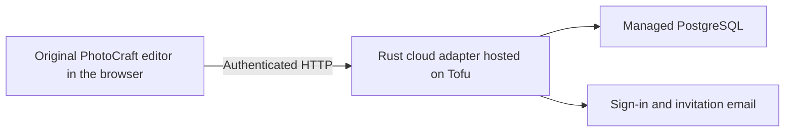

# PhotoCraft Studio on Tofu

PhotoCraft Studio brings the original [PhotoCraft](https://github.com/storytold/photocraft)
Rust editor to a hosted browser workspace. [Tofu](https://trytofu.ai/) supplies the
deployment platform and managed services, so the project can reuse the editor
instead of building a separate editing engine.

## From local editing to a shared workspace

The browser runs PhotoCraft's existing engine through WebAssembly. Painting and
rendering use the user's machine, with hardware WebGPU and the existing WebGL2
fallback. The native `.pcraft` format carries layered documents between local
downloads and cloud saves.

The added Rust HTTP adapter handles cloud projects, versions, access permissions,
comments and bounded live previews. It uses the managed PostgreSQL database and
sign-in services configured through Tofu. Database and provider credentials stay
on the server.

Tofu deploys the Rust service together with the prebuilt browser assets. The
application uses ordinary HTTP requests; it does not depend on a resident worker
or a WebSocket server. [The web guide](web-cloud.md) documents the actual build,
environment settings and adapter boundaries.

## Put your own app online

Tofu helps your coding agent take an existing app from local development to a
live website, with hosting, a managed database, Google sign-in, transactional
email, domains and analytics in one workflow. Start at [trytofu.ai](https://trytofu.ai/)
or follow the [deployment guide](https://trytofu.ai/docs/deploy).

[Try PhotoCraft Studio](https://photocraft-studio-d42c446ec275.trytofu.app/)
to explore the result. Local editing and downloads require no sign-in.

PhotoCraft Studio remains early-alpha software. Its collaboration model and
measured limits are documented in [the collaboration guide](collaboration-architecture.md).
Keep native copies of important work. The upstream ArtCraft team and PhotoCraft
contributors retain credit for the editor; this fork is maintained independently.
